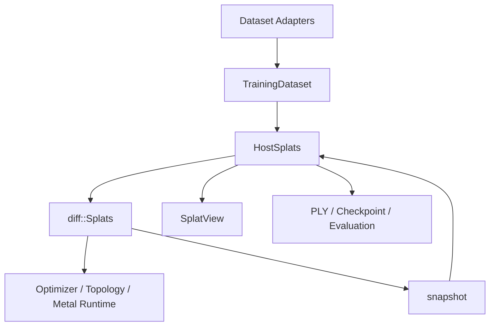

# RustGS Pure-Training Splat Architecture

**Updated:** 2026-04-10  
**Status:** Active design, largely implemented

## Purpose

这份文档是 RustGS 当前唯一的 splat 表示设计文档。它描述：

1. RustGS 现在认可的 canonical splat ownership 模型
2. 已经完成的清理
3. 还剩哪些表示层和命名层收尾工作

## Scope

RustGS 只做 3D Gaussian Splatting 训练。

它不负责：

- SLAM
- map lifecycle
- scene graph ownership
- reconstruction state machine

这些概念如果存在，也应该留在 RustGS 之外，而不是反向污染 RustGS 的 core splat architecture。

## Accepted Type Model

### Canonical Types

- `training::HostSplats`
  - host 侧 SoA 边界类型
  - 负责初始化、PLY、checkpoint、host validation
- `diff::Splats`
  - device/runtime 侧可微训练状态
  - 是 step loop 的 canonical owner
- `training::SplatView`
  - `HostSplats` 的只读借用视图

### Non-Canonical Compatibility Type

- `render::Gaussian`
  - 仅作为 CPU renderer / 测试 / 少量兼容路径的 AoS 适配类型存在
  - 不是 RustGS 核心 ownership 模型

## Why This Design

这套设计解决的是 RustGS 之前最重的表示层问题：

- 同一组 splat 参数被多套 owning type 重复持有
- 训练架构被 scene/map/SLAM 术语污染
- host/device 边界和 runtime mutation 边界混在一起

当前模型把职责拆清楚了：

- 训练时谁是 truth：`diff::Splats`
- 边界时谁负责序列化和交换：`HostSplats`
- 只读消费时谁提供 borrow：`SplatView`

## Implemented Cleanup

### Removed From Code

以下结构已经从当前源码主路径删除：

- `RustGS/src/legacy/*`
- `RustGS/src/training/training_pipeline.rs`
- `RustGS/src/io/dataset_loader.rs`
- `RustGS/src/io/scene_io/scene_import.rs`
- `RustGS/src/io/scene_io/scene_export.rs`

以下 legacy public names 已移除：

- `train_scene`
- `train_from_slam`
- `train_from_path`
- `evaluate_scene`
- `save_scene_ply`
- `load_scene_ply`
- `runtime_from_scene`
- `trainable_from_*`
- `SlamOutput`
- `TrainableGaussians`
- `TrainableColorRepresentation`

### Current Public Surface

当前推荐且保留的 public surface：

- `load_training_dataset_with_source`
- `load_training_dataset`
- `train_splats`
- `train_splats_from_path`
- `evaluate_splats`
- `runtime_from_splats`
- `save_splats_ply`
- `load_splats_ply`
- `TrainingCheckpoint { splats: HostSplats, ... }`

### Boundary Rules

- 初始化从 `TrainingDataset` 进入 `HostSplats`
- 训练上传到 `diff::Splats`
- checkpoint / export / evaluation summary 从 runtime snapshot 回 `HostSplats`
- 不再允许重新引入 scene/map ownership 作为训练主边界

## Comparison With Brush

### Where RustGS Now Matches Brush Better

- 核心训练状态已经有单一 canonical owner：`diff::Splats`
- host/device 边界已经明确，不再靠 scene/map owner 夹在中间
- crate-root 训练入口已经是 dataset/splats-first，而不是 SLAM-first

### Where RustGS Still Differs

- Brush 更接近单一表示到底；RustGS 还保留了一个 `render::Gaussian` AoS 适配层
- RustGS 仍有少量 scene-era 命名留在评估/导出结构里
- RustGS 仍保留 `LegacyMetal` profile 作为活跃训练语义

### Tradeoffs

这套设计相比 Brush 的优点：

- 更符合 Rust + Candle 的 host/device ownership 现实
- checkpoint 和 PLY 可以直接基于 `HostSplats`
- 不再把 RustGS 和 SLAM/map ownership 绑死

这套设计相比 Brush 的缺点：

- 还没有完全到“单表示到底”的极限状态
- 过渡期仍需要维护少量适配层和命名兼容债

## Remaining Cleanup

以下内容仍然属于表示层尾项，而不是主干架构分歧：

1. `render::Gaussian` 还在，虽然已经降级成适配层。
2. `evaluate_gaussians` / `runtime_from_gaussians` 这类 gaussian-facing wrapper 还在。
3. `SceneMetadata`、`SceneEvaluationConfig`、`SceneEvaluationError` 等名字仍带 scene-era 痕迹。

## Ordered Follow-Up Work

1. 把 evaluation/export 周边的 scene-era 命名继续改成 splat-first。
2. 评估 CPU renderer 是否可以直接消费 `SplatView`，从而删掉 `render::Gaussian` 适配层。
3. 单独决策是否还需要保留 `LegacyMetal` profile；这是训练产品决策，不是表示层兼容债。
4. 表示层收口后，把注意力回到 TUM PSNR、parity gate 和 scene-scale-aware normalization。

## Non-Goals

这份设计文档当前不主张做以下事情：

- 引入新的 scene/map owner
- 为了统一内存而取消 host/device distinction
- 让 RustGS 重新承担 SLAM 风格输入对象
- 在表示层还没收口时先做多后端抽象
