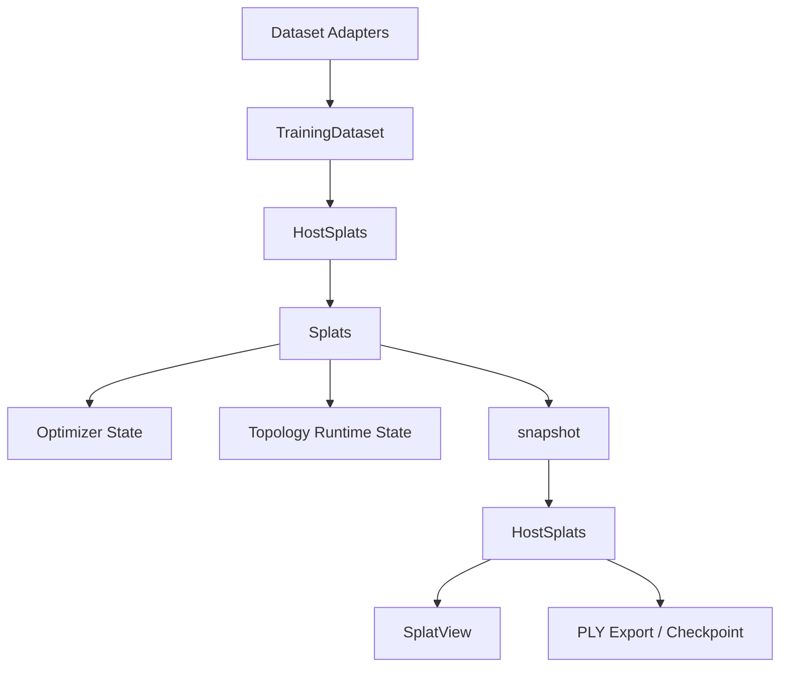

# RustGS Pure-Training Splat Architecture Proposal

## Status

In Progress

## Implementation Progress

### Completed In Code

- Runtime device owner has been renamed to `diff::Splats`.
- A compatibility alias `TrainableGaussians` is still kept so the migration can land incrementally.
- The canonical runtime color-mode name is now `SplatColorRepresentation`; `TrainableColorRepresentation` is retained only as a compatibility alias.
- Host boundary storage has been renamed to `training::HostSplats`.
- `HostSplats` now stores one unified SH payload:
  - `sh_coeffs`
  - `sh_degree`
  - degree-0 rows are stored as SH0, not raw RGB
- `HostSplats` now exposes explicit host/device boundary methods:
  - `HostSplats::upload(...)`
  - `HostSplats::from_runtime(...)`
  - `diff::Splats::snapshot()`
  - `HostSplats::as_view()`
- Crate-root training APIs now expose training-centric entrypoints:
  - `train_splats(&TrainingDataset, ...)`
  - `train_scene(&TrainingDataset, ...)`
  - `train_splats_from_slam(...)`
  - `train_splats_from_path(...)`
- PLY IO now exposes splat-oriented wrappers:
  - `save_splats_ply(...)`
  - `load_splats_ply(...)`
- `save_splats_ply(...)` and `load_splats_ply(...)` now operate directly on `HostSplats` SoA storage instead of round-tripping through `Gaussian` AoS values first.
- Nerfstudio dataset import now prefers `load_splats_ply(...)` and extracts sparse-point bootstrapping data directly from `HostSplats` when GPU support is enabled.
- Evaluation now exposes splat-oriented wrappers:
  - `runtime_from_splats(...)`
  - `evaluate_splats(...)`
- Checkpoint artifacts now serialize the host-side splat payload instead of `GaussianMap`.
- Internal GPU training modules now primarily use the canonical `Splats` / `SplatColorRepresentation` names; the old `Trainable*` aliases are increasingly confined to compatibility helpers and wrappers.
- Training module compatibility wrappers are now explicit as `train_scene(...)`, while `train(...)` remains as a legacy forwarding alias.
- Training initialization now builds `HostSplats` directly in the main data-loading path instead of materializing an intermediate `GaussianMap`.
- Sparse-point initialization now also has a direct `initialize_host_splats_from_points(...)` path, and `training::init_map` no longer round-trips sparse point bootstrapping through `Vec<render::Gaussian>`.
- Initialization now also exposes `initialize_runtime_splats_from_points(...)` as the canonical device-side constructor; `initialize_trainable_gaussians_from_points(...)` remains only as a compatibility wrapper.
- Synthetic benchmark fixtures now build `HostSplats` directly instead of routing through `GaussianMap`.
- Evaluation now exposes splat-first canonical wrappers alongside scene-shaped compatibility wrappers:
  - `evaluate_gaussians(...)`
  - `runtime_from_gaussians(...)`
- The real evaluation report types are now splat-first:
  - `SplatEvaluationSummary`
  - `SplatEvaluationResult`
  - `SceneEvaluationSummary` and `SceneEvaluationResult` remain as compatibility aliases
- Internal host/device transfers now default to splat-runtime naming:
  - `HostSplats::upload(...)`
  - `HostSplats::from_runtime(...)`
  - `runtime_from_splats(...)`
  - `runtime_from_gaussians(...)`
- Crate-level examples and docs now present `TrainingDataset -> train_splats(...) -> save_splats_ply(...)` as the default path instead of SLAM-shaped entrypoints.
- The RustGS CLI training path now loads a `TrainingDataset` directly and trains via `train_splats(...)`; it no longer round-trips the main path through `SlamOutput`.
- The main TUM integration tests now exercise `train_splats_from_path(...)` and `evaluate_splats(...)` directly instead of the `GaussianMap` compatibility path.
- The CPU `GaussianRenderer` now uses gaussian slices as its core input, exposes a direct `render_splats(...)` path, and keeps `GaussianMap` rendering only as deprecated compatibility wrappers.
- `TiledRenderer` now also exposes a SoA-facing `render_splats(...)` / `project_splats(...)` path built directly on `SplatView`, so forward rasterization no longer requires an AoS conversion just to enter the renderer.
- `DiffGaussianRenderer` no longer materializes `Vec<render::Gaussian>` internally; its tensor compatibility surface now converts directly into `HostSplats` and renders through `TiledRenderer::render_splats(...)`.
- `TiledRenderer` projection math is now shared between the AoS compatibility wrapper and the SoA splat path, so the renderer's numerical core no longer forks by representation.
- Chunk planning and chunk-training internals now use `ChunkPlan::training_chunks()` as the primary naming; `trainable_chunks()` remains only as a deprecated compatibility alias.
- Crate-root legacy type exports are now explicitly marked deprecated:
  - `rustgs::GaussianMap`
  - `rustgs::SlamOutput`
- `HostSplats <-> GaussianMap` conversion helpers are now explicitly marked deprecated, and RustGS's own compatibility wrappers no longer rely on them internally.
- Legacy compatibility entrypoints are now explicitly marked deprecated:
  - `train_scene(...)`
  - `train_from_slam(...)`
  - `train_splats_from_slam(...)`
  - `train_from_path(...)`
  - `metal_trainer::train_scene(...)`
  - `metal_trainer::train(...)`
  - `trainable_from_*`
  - `HostSplats::to_trainable(...)` / `HostSplats::from_trainable(...)`
  - `GaussianRenderer::render(...)`
  - `GaussianRenderer::render_depth(...)`
  - `GaussianRenderer::render_depth_and_color(...)`
  - `save_scene_ply(...)`
  - `load_scene_ply(...)`
  - `HostSplats::from_gaussian_map(...)`
  - `HostSplats::from_gaussian_map_for_config(...)`
  - `HostSplats::from_gaussian_map_inferred(...)`
  - `HostSplats::to_gaussian_map(...)`

### Still Pending

- `GaussianMap`, `Gaussian3D`, and scene-oriented conversions are still present in the compatibility path.
- Topology/edit, render compatibility, and some legacy eval/reporting paths still route through `GaussianMap` or `Gaussian3D`, although both `GaussianRenderer` and `TiledRenderer` now have direct splat-facing entrypoints.
- SLAM-shaped compatibility APIs such as `train_from_slam(...)` still exist at crate root, but they are now deprecated and no longer used by the primary CLI path.
- Scene/map terminology still exists in parts of IO, compatibility reporting, and public compatibility APIs.
- `trainable_from_*` helper names and `to_trainable(...)` / `from_trainable(...)` methods still exist as compatibility shims and should eventually be retired once downstream callers are migrated.
- A few deprecated compatibility names still remain in chunking and diff surfaces:
  - `ChunkPlan::trainable_chunks()`
  - `TrainableGaussians`
  - `TrainableColorRepresentation`
- The remaining biggest AoS holdout is now the legacy `render::Gaussian` compatibility surface in scene IO/import-export, `training_pipeline.rs`, and a few renderer wrappers; the numerical render core no longer needs an AoS owner, but the compatibility carrier has not been deleted yet.

### Migration Strategy

The codebase is currently in the intended intermediate state:

- the canonical runtime and host names are in place
- the core upload/snapshot boundary is explicit
- compatibility aliases and wrappers remain so the training path stays buildable while deeper cleanup continues

## Scope

This proposal assumes RustGS is only a 3D Gaussian Splatting training library.

It does not assume RustGS owns:

- SLAM
- map lifecycle management
- scene graph ownership
- reconstruction state machines

Those concerns may exist elsewhere in RustScan, but they should not shape the core splat architecture inside RustGS.

## Goal

Refactor RustGS onto a pure training-centric structure-of-arrays design with:

- `Splats` as the only long-lived runtime splat owner
- `HostSplats` as a host-side boundary type
- `SplatView` as the shared borrowed read-only interface
- no owning array-of-structs Gaussian types
- no scene or map owner in the core splat architecture

## Key Decision

Even on Apple Silicon unified memory, RustGS should still distinguish:

- host-side Rust-owned vectors
- device-side Candle tensor and var ownership

But that does not mean both have to be long-lived main states.

The intended model is:

- `Splats` is the runtime truth during training
- `HostSplats` exists only at boundaries such as initialization, import, export, and checkpointing
- `HostSplats` is not a permanently synchronized mirror of `Splats`

## Why The Current Design Is Too Heavy

RustGS currently mixes multiple overlapping Gaussian owners:

- `core::Gaussian3D`
- `core::GaussianMap`
- `render::tiled_renderer::Gaussian`
- `training::splats::Splats`
- `diff::TrainableGaussians`
- `training_pipeline::TrainableGaussian`

This creates three unnecessary problems for a pure training library.

- The same splat parameters are owned by multiple incompatible types.
- Training architecture is polluted by scene and map concepts.
- RGB and SH semantics are split across several partially overlapping representations.

## Design Principles

- All owning splat parameter types are SoA.
- The runtime parameterization is canonical.
- Host-side types are edge types, not main runtime state.
- Rendering, evaluation, and export work on borrowed views when possible.
- SH degree 0 is the RGB-only case.
- Conversion boundaries are minimal and explicit.

## Proposed Type Model



## Core Types

### `Splats`

This is the main runtime splat type.

It replaces the role currently played by `TrainableGaussians`, but with a much simpler name.

```rust
pub struct Splats {
    pub positions: Var,      // [n, 3]
    pub log_scales: Var,     // [n, 3]
    pub rotations: Var,      // [n, 4], wxyz
    pub opacity_logits: Var, // [n]
    pub sh_coeffs: Var,      // [n, coeff_count(sh_degree), 3]
    pub n: usize,
    pub sh_degree: usize,
    device: Device,
}
```

Responsibilities:

- own the differentiable model state on device
- serve as the only long-lived runtime splat owner
- support optimizer updates, topology mutation, and runtime validation
- expose a `snapshot()` path back to `HostSplats`

Why this should be the center of the architecture:

- RustGS is a training library, so the runtime model state should be first-class
- this moves RustGS closer to Brush's dominant-owner model
- it eliminates the need for parallel scene and render Gaussian owners

### `HostSplats`

This is a host-side boundary type.

It is not the long-lived runtime truth.

```rust
pub struct HostSplats {
    pub positions: Vec<f32>,      // [n * 3]
    pub log_scales: Vec<f32>,     // [n * 3]
    pub rotations: Vec<f32>,      // [n * 4], wxyz
    pub opacity_logits: Vec<f32>, // [n]
    pub sh_coeffs: Vec<f32>,      // [n * coeff_count(sh_degree) * 3]
    pub sh_degree: usize,
}
```

Responsibilities:

- receive initialized splats from datasets and importers
- upload into `Splats`
- receive `snapshot()` output from `Splats`
- act as the serialization and export payload for model artifacts
- provide host-side validation and simple structural transforms

What it should not become:

- a second long-lived training state
- a mirror that is eagerly kept in sync every step
- a scene graph substitute

## Borrowed Types

### `SplatView<'a>`

Shared borrowed read-only view for export, evaluation, and non-owning helpers.

```rust
pub struct SplatView<'a> {
    pub positions: &'a [f32],
    pub log_scales: &'a [f32],
    pub rotations: &'a [f32],
    pub opacity_logits: &'a [f32],
    pub sh_coeffs: &'a [f32],
    pub sh_degree: usize,
}
```

Notes:

- This is not an owning type.
- `HostSplats` can expose `as_view()`.
- `Splats` can expose `snapshot().as_view()` when a host-facing path needs read-only access.

### `SplatIoPayload`

Optional transport-only type for loose import and export boundaries.

This is analogous to Brush's `SplatData`: useful for transport, not a second center of gravity.

```rust
pub struct SplatIoPayload {
    pub positions: Vec<f32>,
    pub log_scales: Option<Vec<f32>>,
    pub rotations: Option<Vec<f32>>,
    pub opacity_logits: Option<Vec<f32>>,
    pub sh_coeffs: Option<Vec<f32>>,
    pub sh_degree: usize,
}
```

## Runtime Sidecars

These are not splat owners and should remain separate from `Splats`:

- optimizer state
- densification accumulators
- prune heuristics
- temporary projected radii
- age counters
- topology bookkeeping

Example:

```rust
pub struct TopologyRuntimeState {
    pub grad_accum: Vec<f32>,    // [n]
    pub max_radii_2d: Vec<f32>,  // [n]
    pub age: Vec<u32>,           // [n]
}
```

Why:

- these values are process state, not model parameters
- keeping them outside `Splats` prevents the main type from becoming a dumping ground

## Shared SH Semantics

The SH model should use one storage rule everywhere:

- `sh_degree = 0` means one coefficient per channel
- `sh_coeffs` is always stored as coefficient-major RGB triplets
- there is no separate RGB-versus-SH type split

That means:

- RGB-only is represented as degree-0 SH
- import converts RGB to SH0 at the boundary
- export converts SH0 back to RGB only for compatibility formats

This removes the need for:

- `GaussianColorRepresentation`
- `TrainableColorRepresentation`
- separate `color`, `sh_dc`, and `sh_rest` ownership fields

## Invariants

Both owning types must expose one strict `validate()` path.

For `HostSplats`:

- `positions.len() == n * 3`
- `log_scales.len() == n * 3`
- `rotations.len() == n * 4`
- `opacity_logits.len() == n`
- `sh_coeffs.len() == n * coeff_count(sh_degree) * 3`

For `Splats`:

- `positions` shape is `[n, 3]`
- `log_scales` shape is `[n, 3]`
- `rotations` shape is `[n, 4]`
- `opacity_logits` shape is `[n]`
- `sh_coeffs` shape is `[n, coeff_count(sh_degree), 3]`

## Allowed Owning Conversions

Only these owning conversions should exist:

- `TrainingDataset -> HostSplats`
- `HostSplats -> Splats`
- `Splats -> HostSplats`

Preferred API rules:

- initialization returns `HostSplats`
- trainer accepts `HostSplats`
- runtime training owns `Splats`
- exporter accepts `HostSplats` or `SplatView`
- checkpointing stores `HostSplats`

## What Can Be Removed

### Remove From Core Architecture

- `core::Gaussian3D`
- `core::GaussianMap`
- `core::GaussianState`
- `render::tiled_renderer::Gaussian`
- `training_pipeline::TrainableGaussian`
- `GaussianColorRepresentation`
- `TrainableColorRepresentation`

These encode scene-oriented or AoS ownership that a pure training library does not need.

### Rename To Match The New Model

- current `diff::TrainableGaussians` -> `Splats`
- current `training::splats::Splats` -> `HostSplats`
- `RenderSplatView` style APIs -> `SplatView`

The naming should communicate:

- `Splats` is the runtime model
- `HostSplats` is the host boundary payload

### Demote To Adapter Or CLI Layer

- `train_from_slam`
- `SlamOutput`-centric entrypoints
- TUM and COLMAP loader re-exports from the crate root
- dataset source auto-detection in the training core

These are dataset-adapter concerns, not splat architecture concerns.

The RustGS core should be shaped around `TrainingDataset`, not around SLAM-derived input forms.

### Rename Scene-Oriented IO APIs

- `save_scene_ply` -> `save_splats_ply`
- `load_scene_ply` -> `load_splats_ply`
- `SceneMetadata` -> `SplatArtifactMetadata` or `ModelMetadata`

If RustGS is not a scene-management library, the public API should not keep scene vocabulary as the default mental model.

## Comparison With Brush

Brush uses one dominant training and rendering owner:

- `Splats<B>` in `brush-render`
- `SplatData` as a transport payload
- direct export from the main splat owner

This proposal deliberately moves RustGS closer to that model than earlier multi-owner drafts.

### Advantages Relative To Brush

- It keeps the dominant-owner idea.
  `Splats` becomes the only long-lived runtime owner, which is the same core architectural move that makes Brush coherent.

- It preserves an explicit host boundary type.
  Brush's training and rendering stack is tighter. RustGS still benefits from a named `HostSplats` artifact type for import, export, checkpointing, and host-side initialization.

- It satisfies the explicit SoA requirement.
  Brush packs means, rotation, and log scales into a single `[n, 10]` tensor. This proposal keeps the columns explicit.

### Disadvantages Relative To Brush

- It still has one more owning type than Brush's strongest form.
  Brush lets its main owner dominate even more of the stack.

- It is less compact.
  Brush's packed transform tensor is more convenient for some fused operations and bulk transfers.

- It relies more on snapshot boundaries.
  Host-facing operations in RustGS will often go through `snapshot()` into `HostSplats`, whereas Brush can often operate directly on its dominant owner.

## Why A Separate Scene Owner Is Not Needed

If RustGS only trains GS, then a separate scene-time owner is architecture debt, not architecture value.

A scene owner only makes sense if RustGS also owns:

- SLAM map lifecycle
- scene merge semantics
- reconstruction ownership
- scene editing outside the training loop

That is not the scope assumed by this proposal.

## Migration Plan

### Phase 1: Semantic Cleanup

- Introduce shared SH helpers.
- Remove RGB-versus-SH split as a type-system fork.
- Make degree-0 SH the only RGB-equivalent path.

### Phase 2: Naming Cleanup

- Rename `TrainableGaussians` to `Splats`.
- Rename current host-side `training::splats::Splats` to `HostSplats`.
- Rename borrowed helper views to `SplatView`.

### Phase 3: Runtime Dominance

- Make `Splats` the only long-lived runtime state.
- Make `HostSplats` boundary-only.
- Remove any logic that tries to keep both as always-live synchronized owners.

### Phase 4: Render And IO Cleanup

- Replace owning render Gaussian types with `SplatView`.
- Rewrite PLY import and export around `HostSplats`.
- Rename scene-oriented IO APIs to splat-oriented names.

### Phase 5: Legacy Removal

- Delete `Gaussian3D`, `GaussianMap`, and old color enums from the main architecture.
- Delete `training_pipeline::TrainableGaussian`.
- Move SLAM and dataset autodetection helpers out of the core splat model.

## Acceptance Criteria

- RustGS has one long-lived runtime splat owner: `Splats`
- RustGS has one host-side boundary splat owner: `HostSplats`
- neither owning splat type is AoS
- core training APIs are shaped around `TrainingDataset`, `HostSplats`, and `Splats`
- rendering and export work through `SplatView` or `HostSplats`
- SH information round-trips without semantic loss
- there is no public SLAM-shaped type in the core splat architecture

## Recommendation

Adopt this proposal if the goal is:

- a pure 3DGS training architecture
- full SoA ownership
- a runtime model closer to Brush
- simpler naming than `TrainableGaussians`

Do not adopt it if RustGS is expected to become a scene-management or SLAM-oriented library again.

In that case, a separate scene owner may be justified. Under the current pure-training assumption, it is not.
